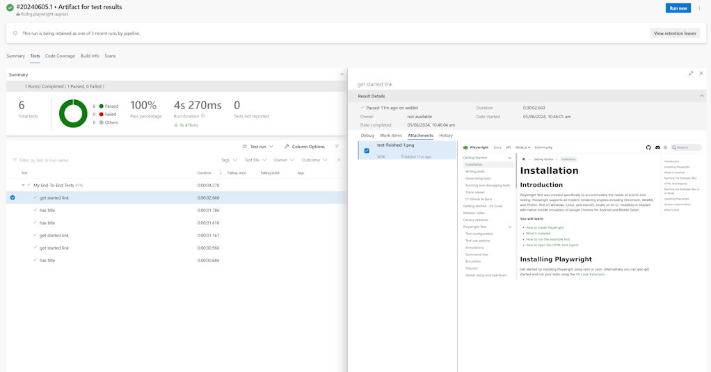

# Playwright with an ASP.NET web application

Demo of using Playwright UI tests with ASP.NET

## Using Azure Pipelines

- [azure-pipelines.yml](azure-pipelines.yml)
- 

Example output which includes an attachment (Playwright screenshot of test):

